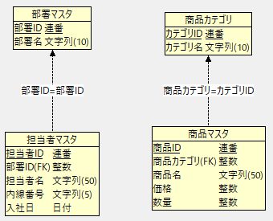

# データベース概要

データベース接続情報に関しては [READMEの「3. データベース設定」](../manuals/getting-started.md#データベース設定)を参照してください。

## 1. ER図

データベース `jbasicdaodb` の概念ER図を以下に示します：

## 2. テーブル定義

上記の概念ER図に定義されているテーブルの定義を以下に示します。

### 2-1. categoriesテーブル

  | 項番 | 項目名（論理名）| 項目名（物理名）| データ型 | サイズ | PK | NOT NULL |
  | ---- | ------------- | -------------- | ------- | ------ | -- | ------ |
  |   1  | カテゴリID     | id             | SERIAL  |   ─   | ◯ | ◯ |
  |   2  | カテゴリ名     | name           | VARCHAR |   10  |  ─ | ◯ |

### 2-2. productsテーブル

  | 項番 | 項目名（論理名）| 項目名（物理名）| データ型 | サイズ | PK | NOT NULL | FK |
  | ---- | ------------- | -------------- | ------- | ------ | -- | ------ | -- |
  |   1  | 商品ID        | id             | SERIAL  |   ─   | ◯ | ◯ | ─ | 
  |   2  | 商品カテゴリID | category_id    | INTEGER |   ─   | ─ | ◯ | categories.id |
  |   3  | 商品名        | name           | VARCHAR |   50  | ─ | ◯ | ─ |
  |   4  | 価格          | price          | INTEGER |   ─   | ─ | ◯ | ─ |
  |   5  | 数量          | quantity       | INTEGER |   ─   | ─ | ─ | ─ |

### 2-3. departmentsテーブル

  | 項番 | 項目名（論理名）| 項目名（物理名）| データ型 | サイズ | PK | NOT NULL |
  | ---- | ------------- | -------------- | ------- | ------ | -- | ------ |
  |   1  | 部署ID        | id             | SERIAL  |   ─   | ◯ | ◯ |
  |   2  | 部署名        | name           | VARCHAR |   10  |  ─ | ◯ |

### 2-4. employeesテーブル

  | 項番 | 項目名（論理名）| 項目名（物理名）| データ型 | サイズ | PK | NOT NULL | FK |
  | ---- | ------------- | -------------- | ------- | ------ | -- | ------ | -- |
  |   1  | 担当者ID      | id             | SERIAL  |   ─   | ◯ | ◯ | ─ | 
  |   2  | 部署ID        | department_id  | INTEGER |   ─   | ─ | ◯ | departments.id |
  |   3  | 担当者名       | name           | VARCHAR |   50  | ─ | ◯ | ─ |
  |   4  | 内線番号       | phone          | CHAR    |   5   | ─ | ◯ | ─ |
  |   5  | 入社日         | hired_date     | DATE    |   ─   | ─ | ◯ | ─ |

### 2-5. 補足：IDの自動採番について

各テーブルの主キーは自動採番機能の伴った `SERIAL` で定義しています。
しかし、PostgreSQL の最近の流儀では `GENERATED AS IDENTITY` が推奨されています。

この `SERIAL` と `GENERATED AS IDENTITY` の違いは以下のとおりです：

  - **SERIAL**：簡単に自動採番できるが、内部でシーケンスが作られる。
  - **GENERATED AS IDENTITY**：SQL標準準拠。より明示的で制御しやすい。

このチュートリアルでは `SERIAL` の方が書き方が短く、学習者にとってわかりやすいため採用しています。  
実務では`GENERATED AS IDENTITY` が推奨されています。

## 3. データベースとテーブルの初期化

データベースを初期化するには

- [チュートリアル一覧に戻る](./tutorials.md)