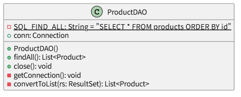

# *T2.1*　DAOによるCRUD操作・検索 ～ DAOを導入してみる・継承編

[Javaによるデータベース接続とCRUD操作のチュートリアル](../tutorials.md) > [DAOによるCRUD操作](./20-dao.md)

---
### 今回のチュートリアル対象

- コミット：[cfbe481](https://github.com/612-teacher001/jbasic-dao-demo/commit/cfbe481)
- クラス：[`jp.example.app.dao.ProductDAO`](https://github.com/612-teacher001/jbasic-dao-demo/blob/main/src/main/java/jp/example/app/dao/ProductDAO.java)

---

## 1. 概要

このチュートリアルでは、**ProductDAOをBaseDAOとProductDAOに分離する過程** について逐次的に分解して解説します。

---

## 2. 事前準備

データベースの詳細については、データベース接続情報を含めて [データベース概要](../00-database.md) を参照してください。

---

## 3. 実況

### 3.1. 基本形としてのProductDAO（再掲）
<figure>
<figcaption>● ProductDAOの初期版のクラス図 ●</figcaption>
<!--  -->

</figure>

クラス図のアクセス修飾子については [参照：クラス図のアクセス修飾子](#access) を参照してください。

### 3.2. 共通処理にまとめてみる
`ProductDAO`としては上記のクラス図で本来は十分です。

ただし、他のテーブルにアクセスするDAOということを考慮してDAOを設計するときには、テーブルに依存する処理と依存しない処理に分けて整理することが重要です。

- テーブルに依存する処理：各種DAOによって異なる部分
	- SQL文
	- 各種CRUD操作実現メソッド（`findAll()` など）
	- CRUD捜査補助メソッド（`convertToList(ResultSet)` など）
- テーブルに依存しない処理：各種DAOに共通な部分
	- データベース接続情報の取得
	- データベース接続情報をもとにしたデータベース接続（データベース接続オブエジェクトの取得）
	- データベース接続オブジェクトの破棄

テーブルに依存しない処理については共通のクラスに任せると、他のDAOからもそのクラスを利用することができます。

### 3.3. 共通処理をBaseDAOに統合する（継承による統合の実現）
テーブルに依存しない部分を共通化するためには、共通化処理に特化したクラスを作成して、具体的な個々のテーブルに対応するDAOが継承するようにします。

<figure>
<figcaption>● BaseDAOとProductDAOの継承 ●</figcaption>
<!--  -->

</figure>

クラス図のアクセス修飾子については [参照：クラス図のアクセス修飾子](#access) を参照してください。

---

## 4. まとめ

ここのコードで学ぶべきポイント：

- BaseDAOに `AutoCloseable` インタフェースを実装したので、BaseDAOを継承するすべてのDAOはtry-with-resourcesを利用することでリソースの自動破棄が可能になる
- BaseDAOを継承することによって、BaseDAOを継承するすべてのDAOは独自に実装することなく、コンストラクタを呼び出すことで一貫した方法でデータベース接続情報を取得し、データベース接続をすることができる
- BaseDAOを継承するDAOでは、SQL文の生成やCRUD操作を実現するメソッドの実装に専念できる

## 参考：クラス図のアクセス修飾子
上記本文中には、ProductDAO、BaseDAOとAutoCloseableのクラス図を示しました。

このようなクラス図は　*UML（Uniformed Modeling Language）* という記法で描かれています。  
このクラス図のフィールド名やメソッド名の冒頭に記号が記されていますが、これらはそのフィールドやメソッドのアクセス修飾子を表しています。

UMLのダイアグラムを描画するツールは数多くありますが、ここでは PlantUML という記法を採用しています。  
この記法によるアクセス修飾子の記号の意味は以下のとおりです：

| 記号 | アクセス修飾子名 | 意味 |
| ---- | -------------- | ---- |
| ●    | `public`    | パッケージを超えてどこからでもアクセスできる             |
| ◇   | `protected` | 継承クラスからのみアクセスできる                        |
| ■    | `private`   | そのクラス内または宣言したブロックからのみアクセスできる  |
| 下線 | `static`    | クラスに属するメンバ（インスタンス化せずにアクセスできる） |
| □    | `final`     | 初期値で初期化したあとは別の値で上書きできない           |

PlantUMLについては [一目でわかるPlantUML](https://plantuml.com/ja/) を参照してください。

---

[Javaによるデータベース接続とCRUD操作のチュートリアル](../tutorials.md) > [DAOによるCRUD操作](./20-dao.md)
