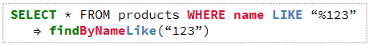

# *T2.1*　DAOによるCRUD操作・検索 ～ 商品IDで検索してみる・共通メソッド化編

[Javaによるデータベース接続とCRUD操作のチュートリアル](../tutorials.md) > [DAOによるCRUD操作](./20-dao.md)

---
### 今回のチュートリアル対象

- コミット：[7ed01f5](https://github.com/612-teacher001/jbasic-dao-demo/commit/7ed01f5)
- クラス：[`jp.example.app.dao.ProductDAO`](https://github.com/612-teacher001/jbasic-dao-demo/blob/main/src/main/java/jp/example/app/dao/ProductDAO.java)

---

## 1. 概要

このチュートリアルでは、**ProductDAOのメソッドを共通メソッド化する過程** について逐次的に分解して解説します。

---

## 2. 事前準備

データベースの詳細については、データベース接続情報を含めて [データベース概要](../00-database.md) を参照してください。

---

## 3. 実況

### 3.1. 共通メソッド化されたProductDAO
<figure>
<figcaption>● 共通メソッド化したProductDAOとBaseDAOのクラス図 ●</figcaption>
<!--  -->

</figure>

クラス図のアクセス修飾子については前回のチュートリアルの [参照：クラス図のアクセス修飾子](./21-dao-id_01.md#access) を参照してください。

### 3.2. 共通処理にまとめてみる
主キー検索を実行する補助メソッド `convertToProduct(ResultSet)` には、結果セットから商品インスタンスを生成するロジックが含まれています。  

一方で、全件検索を実行するメソッド `convertToList(ResultSet)` メソッドにも同じような処理ロジックが組まれています。  
これらのメソッドを再掲すると以下のようになります：

```java
private Product convertToProduct(ResultSet rs) throws SQLException {
	// 1. 戻り値の初期化
	Product product = null;
	// 2. 結果セットの現在行を商品インスタンスに変換：createProductメソッドの呼び出し
	if (rs.next()) {
		// 3. 現在の行の各フィールド値を取得
		int id = rs.getInt("id");                  // 商品ID（id）
		int categoryId = rs.getInt("category_id"); // カテゴリID（categoryId）
		String name = rs.getString("name");        // 商品名（name）
		int price = rs.getInt("price");            // 価格（price）
		int quantity = rs.getInt("quantity");      // 数量（quantity）
		product = new Product(id, categoryId, name, price, quantity);
	}
	// 4. 戻り値の返却
	return product;
}

private List<Product> convertToList(ResultSet rs) throws SQLException {
	// 1. 戻り値の初期化
	List<Product> list = new ArrayList<>();
	// 2. 結果セットの１行ごとの読み込み
	while (rs.next()) {
		// 3. 現在の行の各フィールド値を取得
		int id = rs.getInt("id");                  // 商品ID（id）
		int categoryId = rs.getInt("category_id"); // カテゴリID（categoryId）
		String name = rs.getString("name");        // 商品名（name）
		int price = rs.getInt("price");            // 価格（price）
		int quantity = rs.getInt("quantity");      // 数量（quantity）
		list.add(new Product(id, categoryId, name, price, quantity));
	}
	// 4. 戻り値の返却
	return list;
}
```

このように同じ処理が実装されるので、この処理部分を共通メソッド化します。

### 3.3. 共通メソッド化
共通化の結果、以下のような `createProduct` メソッドを定義します：
```java
// 共通部分を切り出したメソッド
private Product createProduct(ResultSet rs) throws SQLException {
    int id = rs.getInt("id");
    int categoryId = rs.getInt("category_id");
    String name = rs.getString("name");
    int price = rs.getInt("price");
    int quantity = rs.getInt("quantity");
    return new Product(id, categoryId, name, price, quantity);
}
```
このメソッドはDAO内部だけで利用する補助メソッドなので `private` にしています。


---

## 4. まとめ

ここのコードで学ぶべきポイント：

  - 結果セットから商品オブジェクトを生成する処理は、全件検索と主キー検索の両方で共通している
  - 共通部分を `createProduct(ResultSet)` メソッドに切り出すことで、コードの重複を避け、保守性が向上する
  - DAO内部だけで利用する補助メソッドなので、アクセス修飾子は `private` にする

---

## 📌補足：DAOメッソッドの命名規則

DAOではCRUD操作を実行するメソッド名としては **一定の慣習** があります：

| 操作内容 | メソッド名 | 意味 |
| ------- | --------- | ---- |
| 検索（全件／条件付） | `findAll, findById, findByName, etc...` | レコードを検索して取得する |
| 登録（追加）        | `insert` | レコードを新規に追加する |
| 更新               | `update` | レコードを更新する |
| 削除               | `delete` | レコードを削除する |

- 検索には find を使うのが一般的
- 追加は insert、更新は update、削除は delete が定番
- プロジェクト全体で統一することで、可読性と理解しやすさが向上する

### 検索系メソッドのバリエーション

検索系メソッド名のおもな例を以下に示します：

- **全件検索のメソッド名の構成** 
  <figure>
  
  </figure>

  - `SELECT` 句に対してメソッド名の接頭辞 `find`が対応します。  
  - テーブルの情報はDAOによって決まっているので `FROM` 句はメソッド名に入れません。  
  - 検索条件や並べ替えの指定がないので `All` を追記します。

- **主キー検索のメソッド名の構成**
  <figure>
  
  </figure>

  - `SELECT` 句に対してメソッド名の接頭辞 `find`が対応します。
  - テーブルの情報はDAOによって決まっているので `FROM` 句はメソッド名に入れません。
  - `WHERE` 句に対しては接頭辞 `find` に続けて `By` 句を記述します。
  - 検索条件とするフィールド名を `By` 句に続けて記述します。
  - 検索条件としてフィールドに指定する具体的な値はメソッドの引数として指定します。
	
- **氏名のあいまい検索のメソッド名の構成**
  <figure>
  
  </figure>

  - `SELECT` 句に対してメソッド名の接頭辞 `find`が対応します。
  - テーブルの情報はDAOによって決まっているので `FROM` 句はメソッド名に入れません。
  - `WHERE` 句に対しては接頭辞 `find` に続けて `By` 句を記述します。
  - 検索条件とするフィールド名を `By` 句に続けて記述します。
  - あいまい検索なのでSQLでは `LIKE` 演算子を使います。そのためメソッド名も検索フィールド名に続けて `Like` を記述します。  
  - 検索条件としてフィールドに指定する具体的な値はメソッドの引数として指定します。  
	あいまい検索なのでワイルドカード `*` が必要ですが、それを付加するのはメソッドの実装で行います。

- **価格氏名のあいまい検索のメソッド名の構成**
  <figure>
  
  </figure>

  - `SELECT` 句に対してメソッド名の接頭辞 `find`が対応します。
  - テーブルの情報はDAOによって決まっているので `FROM` 句はメソッド名に入れません。
  - `WHERE` 句に対しては接頭辞 `find` に続けて `By` 句を記述します。
  - 検索条件とするフィールド名を `By` 句に続けて記述します。
  - 範囲検索ですが、SQLでは「未満」が指定されているので、`LessThan` をメソッド名に追記します。
  - 並べ替え `ORDER BY` が指定されているので、`OrderBy`を追記しています。

- **図中のSQLとメソッド名と文字色の対応表**

  | メソッドッ名の部分 | 対応するSQL句 | 文字色  | 説明                        |
  | ---------------- | ------------- | ------ | --------------------------- |
  | `find`           | `SELECT`      | 緑色   | 検索操作であることを表す接頭辞 |
  | `ById`           | `WHERE id`    | 赤色   | 検索条件のフィールド名         |
  | `Like`           | `LIKE`        | 青色   | あいまい検索を実行する演算子   |
  | `OrderById`      | `ORDER BY id` | 茶色   | 並べ替えの指定                |


---

[Javaによるデータベース接続とCRUD操作のチュートリアル](../tutorials.md) > [DAOによるCRUD操作](./20-dao.md)
