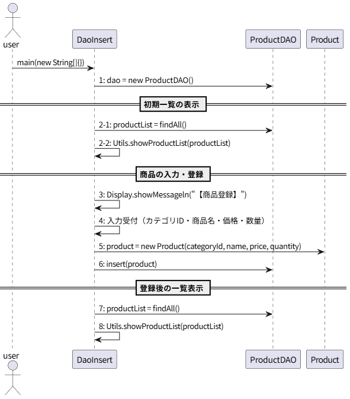

# *T2.1*　DAOによるCRUD操作・登録 ～ 商品を新規登録してみた編

[Javaによるデータベース接続とCRUD操作のチュートリアル](../tutorials.md) > [DAOによるCRUD操作](./20-dao.md)

---
### 今回のチュートリアル対象

- コミット：[e31618c](https://github.com/612-teacher001/jbasic-dao-demo/commit/e31618c)
- クラス：[`jp.example.app.t2.DaoInsert`](https://github.com/612-teacher001/jbasic-dao-demo/blob/main/src/main/java/jp/example/app/t2/DaoInsert.java)  
　　　[`jp.example.app.dao.ProductDAO`](https://github.com/612-teacher001/jbasic-dao-demo/blob/main/src/main/java/jp/example/app/dao/ProductDAO.java)

---

## 1. 概要

このチュートリアルでは、**DAOを使ったレコード登録の方法** について解説します。

---

## 2. 事前準備

データベースの詳細については、データベース接続情報を含めて [データベース概要](../00-database.md) を参照してください。

---

## 3. 解説

## 3.1. 処理の流れ
`DaoInsert#main` メソッドの処理の流れは以下のようになります：
<figure>
<figcaption>● DaoInsert#mainメソッドの処理の流れ図 ●</figcaption>
<!--  -->

</figure>

- この図では `DaoInsert` クラスと `ProductDAO` クラスが互いにどのようなメソッドを呼び出しているのかという関連を示しています。  
そのため、今回のシーケンス図では `DaoInsert` と `ProductDAO` の間のやり取りに限定して描画しています
- サンプルコードにはありませんが、全体の処理の大まかに分類しています：

	- 初期一覧の表示
	- 商品の入力・登録
	- 登録後の一覧表示

- このような図を **シーケンス図（sequence diagram）** といいます。  
シーケンス図はUMLで用意されているダイアグラムの一つで、実務では設計書や仕様書に盛り込まれることが多いので、このダイアグラムに慣れて置くとよいでしょう。

## 3.2. `DaoInsert` クラス
```java
public class DaoInsert {

	public static void main(String[] args) {
		
		try (// 手順-1. ProductDAOをインスタンス化
			 ProductDAO dao = new ProductDAO();) {
			// 手順-2. 全件表示
			List<Product> list = dao.findAll();
			Utils.showProductList(list);
			// 手順-3. 商品を新規登録するメッセージを表示
			Display.showMessageln("【商品登録 ft. ProductDAO】");
			// 手順-4. キーボードから登録する情報を取得（カテゴリID、商品名、価格、数量）
			int categoryId = Keyboard.getInputNumber("カテゴリID：");
			String name = Keyboard.getInputString("商品名：");
			int price = Keyboard.getInputNumber("価格：");
			int quantity = Keyboard.getInputNumber("数量：");
			// 手順-5. 入力値をもとに登録する商品をインスタンス化
			Product product = new Product(categoryId, name, price, quantity);
			// 手順-6. 商品インスタンスを登録
			dao.insert(product);
			// 手順-7. 商品リスト再取得
			list = dao.findAll();
			// 手順-8. 商品リストを表示
			System.out.println();
			Utils.showProductList(list);
			
		} catch (SQLException e) {
			// 例外が発生した場合：スタックトレースを表示（必要最低限のエラー情報を表示）
			e.printStackTrace();
			return;
		}

	}

}
```
- メソッドヘッダは途中省略しました。
- 手順-1では、データベース接続関連の処理を実行します。  
データベース接続情報の取得とデータベース接続オブジェクトの取得をこの1行で完了していることに留意してください。
- 手順-2では、全商品リストの表示処理を実行しています。
- 手順-3では、処理の内容をタイトルして表示しています。  
「【商品登録 ft. ProductDAO】」と表示されますが、JDBCのチュートリアルでは「【商品登録】」だったのであえて違う表示にしています。
- 手順-4では、キーボードから入力された登録する商品の各フィールド値を変数に格納する処理です。  
- 手順-5では、取得した入力値を元に登録対象商品のインスタンスを生成しています。  
このときコンストラクタ `Product(categoryId, name, price, quantity)` によってインスタンス化していることに留意してください。  
この処理ではレコード追加であり、この時点で商品IDはまだ決定されていません。
productsテーブルの定義から `id` フィールドに自動付番制約が設定されているので、商品IDが決定されるのはINSERT文の実行時です。
- 手順-6では、`dao.insert(product)` メソッドを呼び出して更新処理を実行しています。
- 手順-7では、登録対象商品が登録されているかを確認するために、あらためてproductsテーブルの全レコードを商品リストとして取得しています。
- 手順-8では、取得した商品リストを表示しています。  
登録対象商品が正しくproductsテーブルに登録されたかどうかを確認するために、この商品リストの再表示しています。

### 3.3. `ProductDAO` クラス
```java
public class ProductDAO extends BaseDAO {

	/**
	 * クラス定数
	 */
	// SQL文字列群
  ...（中略）...

	private static final String SQL_INSERT = "INSERT INTO products (category_id, name, price, quantity) VALUES (?, ?, ?, ?)";
	
  ...（中略）...

	/**
	 * 商品を登録する
	 * @param product 登録対象商品インスタンス
	 * @throws SQLException 結果セット処理でエラーが発生した場合
	 */
	public void insert(Product product) throws SQLException {
		try (// 1. SQL実行オブジェクトを取得
			 PreparedStatement pstmt = this.conn.prepareStatement(SQL_INSERT)) {
			// 2. プレースホルダをパラメータに置換
			pstmt.setInt(1, product.getCategoryId());
			pstmt.setString(2, product.getName());
			pstmt.setInt(3, product.getPrice());
			pstmt.setInt(4, product.getQuantity());
			// 3. SQSLの実行
			pstmt.executeUpdate();
		}
	}

...（中略）...

}
```
- クラスヘッダは途中省略しました。
- SQLの準備・実行・結果変換までをDAO内部で完結させているため、呼び出し側は検索メソッドを呼ぶだけで商品リストを得られます。  
検索メソッドでは以下の処理を実行します：
  1. SQL実行オブジェクトの取得
  2. プレースホルダのパラメータバインド（このチュートリアルでは「パラメータで置換」と表現しています）
  3. SQLの実行
- テーブルの状態を変更するSQLを実行するので、`PreparedStatement#executeUpdate()` メソッドを呼び出しています。
- INSERT文だけでなく、UPDATE文、DELETE文も同じようなステップで構成された流れの処理になります。  
	　<div style="padding-left: 35px; font-weight: bold;">SQLオブジェクトの取得 ⇒ パラメータバインド ⇒ SQLの実行</div>

## 5. まとめ

ここのコードで学ぶべきポイント：

  - JDBC編と同じ検索処理 を、DAOを導入すると **呼び出し側は1行で済む**
  - DAOによる登録・更新・削除の操作はテーブルの状態（レコードの状態）を更新するので `executeUpdate()` メソッドを呼び出す

---

[Javaによるデータベース接続とCRUD操作のチュートリアル](../tutorials.md) > [DAOによるCRUD操作](./20-dao.md)
