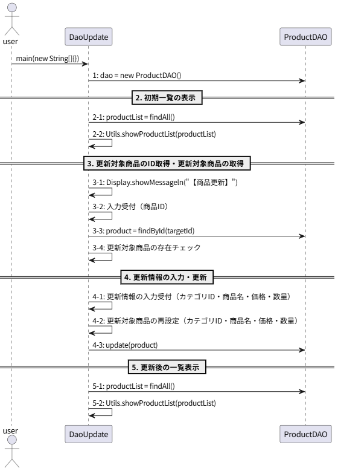

# *T2.22*　DAOによるCRUD操作・更新 ～ 商品を更新してみた編

[Javaによるデータベース接続とCRUD操作のチュートリアル](../tutorials.md) > [DAOによるCRUD操作](./20-dao.md)

---
### 今回のチュートリアル対象

- コミット：[a42cc67](https://github.com/612-teacher001/jbasic-dao-demo/commit/a42cc67)
- クラス：[`jp.example.app.t2.DaoUpdate`](https://github.com/612-teacher001/jbasic-dao-demo/blob/main/src/main/java/jp/example/app/t2/DaoUpdate.java)  
　　　[`jp.example.app.dao.ProductDAO`](https://github.com/612-teacher001/jbasic-dao-demo/blob/main/src/main/java/jp/example/app/dao/ProductDAO.java)

---

## 1. 概要

このチュートリアルでは、**DAOを使ったレコード更新の方法** について解説します。

---

## 2. 事前準備

データベースの詳細については、データベース接続情報を含めて [データベース概要](../00-database.md) を参照してください。

---

## 3. 解説

## 3.1. 処理の流れ
`DaoUpdate#main` メソッドの処理の流れは以下のようになります：
<figure>
<figcaption>● DaoUpdate#mainメソッドの処理の流れ図 ●</figcaption>
<!--  -->

</figure>

- この図では `DaoUpdate` クラスと `ProductDAO` クラスが互いにどのようなメソッドを呼び出しているのかという関連を示しています。  
そのため、今回のシーケンス図では `DaoUpdate` と `ProductDAO` の間のやり取りに限定して描画しています
- サンプルコードにはありませんが、全体の処理の大まかに分類しています：

	- 初期一覧の表示
	- 更新対象商品の選択（商品IDの取得と・インスタンスの取得）
	- 更新対象商品インスタンスの再設定と更新
	- 登録後の一覧表示

- 更新処理では既存のレコードが必要になるので更新対象商品の取得が必要になります。  
処理対象の商品がない場合は登録、処理対象の商品がある場合は更新という違いがあります。


## 3.2. `DaoUpdate` クラス
```java
public class DaoUpdate {

	public static void main(String[] args) {
		
		try (// 手順-1. ProductDAOをインスタンス化
			 ProductDAO dao = new ProductDAO();) {
			// 手順-2. 初期一覧の表示
			//   2-1. 全件取得
			List<Product> productList = dao.findAll();
			//   2-2. 商品リストの表示
			Utils.showProductList(productList);
			// 手順-3. 更新対象商品のID取得と更新対象商品の取得
			//   3-1. 商品を更新するメッセージを表示
			Display.showMessageln("【商品更新 ft. ProductDAO】");
			//   3-2. キーボードから更新対象商品のIDを取得
			int targetId = Keyboard.getInputNumber("更新する商品のIDを入力してください：");
			//   3-3. 入力された商品IDから商品を取得
			Product target = dao.findById(targetId);
			//   3-4. 取得した商品の存在チェック
			if (target == null) {
				Display.showMessageln("指定されたIDの商品は見つかりませんでした。");
				return;
			}
			// 手順-4. 更新情報の入力と更新処理
			//   4-1. キーボードから更新する情報を取得（カテゴリID、商品名、価格、数量）
			int categoryId = Keyboard.getInputNumber("カテゴリID（現：" + target.getCategoryId() + "）：");
			String name = Keyboard.getInputString("商品名（現：" + target.getName() + "）：");
			int price = Keyboard.getInputNumber("価格（現：" + target.getPrice() + "）：");
			int quantity = Keyboard.getInputNumber("数量（現：" + target.getQuantity() + "）：");
			//   4-2. 取得した情報で更新対象商品を再設定（カテゴリID、商品名、価格、数量）
			target.setCategoryId(categoryId);
			target.setName(name);
			target.setPrice(price);
			target.setQuantity(quantity);
			//   4-3. 更新対象商品を更新
			dao.update(target);
			// 手順-5. 更新後の一覧表示
			//   5-1. 全件取得
			productList = dao.findAll();
			//   5-2. 商品リストの表示
			System.out.println();
			Utils.showProductList(productList);
		} catch (SQLException e) {
			// 例外が発生した場合：スタックトレースを表示（必要最低限のエラー情報を表示）
			e.printStackTrace();
			return;
		}

	}

}
```
- メソッドヘッダは途中省略しました。
- 手順-1と手順-2の処理内容は前回の登録編と同じです。
- 手順-3では、更新対象商品を取得する処理を実行しています。  
3-1は表示文字列が違うだけで処理内容は前回の登録編と同じです。  
また、3-2から3-4までは主キー検索編と同じ内容になっています。
- 手順-4では、更新対象商品の更新情報の取得とSQLの実行をしています。
	- 4-1では、現在の更新対象商品のフィールド値を表示つつキーボードから入力された更新内容を取得しています。  
	- 4-2では、`Product` クラスのセッターメソッドを呼び出して、入力された値で更新対象商品の各フィールドを再設定しています。  
	- 4-3では、`ProductDAO#update(Product)` メソッドを呼び出してSQLを実行しています。
- 手順-5の処理内容は前回の登録編と同じです。

### 3.3. `ProductDAO` クラス
```java
public class ProductDAO extends BaseDAO {

	/**
	 * クラス定数
	 */
	// SQL文字列群
  ...（中略）...

	private static final String SQL_UPDATE = "UPDATE products SET category_id = ?, name = ?, price = ?, quantity = ? WHERE id = ?";
	
  ...（中略）...

	/**
	 * 商品を更新する
	 * @param product 更新対象商品インスタンス
	 * @throws SQLException 結果セット処理でエラーが発生した場合
	 */
	public void update(Product product) throws SQLException {
		try (// 1. SQL実行オブジェクトを取得
			 PreparedStatement pstmt = this.conn.prepareStatement(SQL_UPDATE);) {
			// 2. プレースホルダをパラメータに置換
			pstmt.setInt(1, product.getCategoryId());
			pstmt.setString(2, product.getName());
			pstmt.setInt(3, product.getPrice());
			pstmt.setInt(4, product.getQuantity());
			pstmt.setInt(5, product.getId());
			// 3. SQLの実行
			pstmt.executeUpdate();
		}
	}

...（中略）...

}
```
- クラスヘッダは途中省略しました。
- 処理のステップは `ProductDAO#insert()` メソッドを同じです。
- 更新処理なのでSQLでは更新するレコードの主キー `id` を指定する条件が必須です。  
最後のプレースホルダはこの更新対象を絞り込むための条件です。

## 4. 問題点
- 更新処理も登録処理も `PrepareStatement#setInt(int, int)` と `PreparedStatement#setString(int, String)` の両方のメソッドを利用しています。  
更新では `WHERE id = ?` のために主キーを利用しますが、登録では主キーを指定せずDBの自動採番に任せます。  
この更新と登録の違いについて以下のようにまとめました：

	| 処理（操作） | 対象インスタンスの状態 | 置換されるプレースホルダ |
	| ----------- | -------------------- | ---------------------- |
	| 更新        | DBから取得したインスタンスには商品IDがすでに設定されている | 主キーに対するプレースホルダは条件の絞り込み |
	| 登録        | 新しく生成したインスタンスには商品IDはまだ設定されていない | 主キー以外のフィールドが設定されている       | 

- 主キーに対する扱い方以外の処理は更新も登録も同じです。  
  　　⇒ 【解決策】共通化して、更新の場合と登録の場合とで主キーに対する扱い方を切り替える

## 5. まとめ

ここのコードで学ぶべきポイント：

  - JDBC編と同じ更新処理も、DAOを導入すれば **呼び出し側は1行で済む**
  - DAOによる更新操作はテーブルの状態（レコードの状態）を更新するので `executeUpdate()` メソッドを呼び出す

---

[Javaによるデータベース接続とCRUD操作のチュートリアル](../tutorials.md) > [DAOによるCRUD操作](./20-dao.md)
