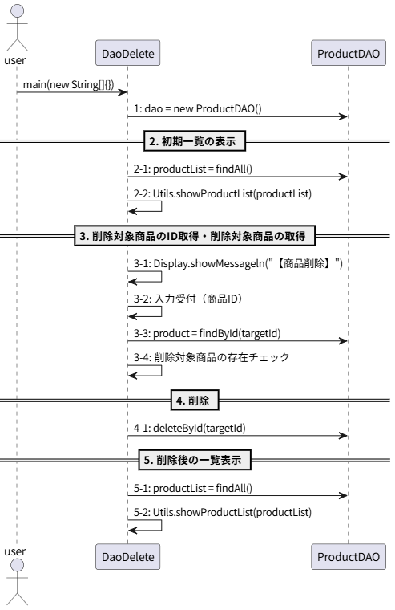

# *T2.23*　DAOによるCRUD操作・削除 ～ 商品を削除してみた編

[Javaによるデータベース接続とCRUD操作のチュートリアル](../tutorials.md) > [DAOによるCRUD操作](./20-dao.md)

---
### 今回のチュートリアル対象

- コミット：[f2d9d62](https://github.com/612-teacher001/jbasic-dao-demo/commit/f2d9d62)
- クラス：[`jp.example.app.t2.DaoDelete`](https://github.com/612-teacher001/jbasic-dao-demo/blob/main/src/main/java/jp/example/app/t2/DaoDelete.java)  
　　　[`jp.example.app.dao.ProductDAO`](https://github.com/612-teacher001/jbasic-dao-demo/blob/main/src/main/java/jp/example/app/dao/ProductDAO.java)

---

## 1. 概要

このチュートリアルでは、**DAOを使ったレコード削除の方法** について解説します。

---

## 2. 事前準備

データベースの詳細については、データベース接続情報を含めて [データベース概要](../00-database.md) を参照してください。

---

## 3. 解説

今回のチュートリアルは、更新処理と登録処理で共通している部分をまとめて補助メソッド化した部分について解説します。

## 3.1. 処理の流れ
`DaoInsert#main` メソッドの処理の流れは以下のようになります：
<figure>
<figcaption>● DaoDelete#mainメソッドの処理の流れ図 ●</figcaption>
<!--  -->

</figure>


## 3.2. `DaoDelete` クラス

```java
public class DaoDelete {

	public static void main(String[] args) {
		try (// 手順-1. ProductDAOをインスタンス化
			 ProductDAO dao = new ProductDAO();) {
			// 手順-2. 初期一覧の表示
			//   2-1. 全件取得
			List<Product> productList = dao.findAll();
			//   2-2. 商品リストの表示
			Utils.showProductList(productList);
			System.out.println();
			// 手順-3. 削除対象商品のID取得と削除対象商品の取得
			//   3-1. 商品を削除するメッセージを表示
			Display.showMessageln("【商品削除 ft. ProductDAO】");
			//   3-2. キーボードから削除対象商品のIDを取得
			int targetId = Keyboard.getInputNumber("削除する商品のIDを入力してください：");
			//   3-3. 入力された商品IDから商品を取得
			Product target = dao.findById(targetId);
			//   3-4. 取得した商品の存在チェック
			if (target == null) {
				Display.showMessageln("指定されたIDの商品は見つかりませんでした。");
				return;
			}
			// 手順-4. 削除処理
			dao.deleteById(targetId);
			// 手順-5. 更新後の一覧表示
			//   5-1. 全件取得
			productList = dao.findAll();
			//   5-2. 商品リストの表示
			System.out.println();
			Utils.showProductList(productList);
		} catch (SQLException e) {
			// 例外が発生した場合：スタックトレースを表示（必要最低限のエラー情報を表示）
			e.printStackTrace();
			return;
		}
		
	}

}
```
- クラスヘッダは途中省略しました。
- 全体の処理の流れは、登録や更新の場合と同じなので割愛します。
- 3-4では、取得した商品が存在しない場合でもエラーとならずに削除することができます。  
しかし不要なDELETE文を実行してしまうことになるので冗長になるので、存在チェックをして存在しない場合はDELETE分の実行を抑制しています。
- 手順-4では、`ProductDAO#deleteById(int)` メソッドを呼び出して、商品IDを指定して商品を削除しています。  
一度削除したレコードは復元できません。  
このチュートリアルでは確認処理を省略していますが、実務では削除前に対象レコードを表示してユーザーに確認を取ることが一般的です。

## 3.3. `ProductDAO` クラス
```java
public class ProductDAO extends BaseDAO {

	/**
	 * クラス定数
	 */
	// SQL文字列群
  ...（中略）...

	private static final String SQL_DELETE_BY_ID = "DELETE FROM products WHERE id = ?";
	
  ...（中略）...

	/**
	 * 指定されたIDの商品を削除する
	 * @param id 削除対象の商品ID
	 * @throws SQLException 結果セット処理でエラーが発生した場合
	 */
	public void deleteById(int id) throws SQLException {
		try (// 1. SQL実行オブジェクトの取得
			 PreparedStatement pstmt = this.conn.prepareStatement(SQL_DELETE_BY_ID);) {
			// 2. プレースホルダをパラメータで置換
			pstmt.setInt(1, id);
			// 3. SQLの実行
			pstmt.executeUpdate();
		}
	}

...（中略）...

}
```
- クラスヘッダは途中省略しました。
- 実行するSQLは削除なので、個別のレコードを削除するには `WHERE id = ?` という条件が必須です。  
条件を省略するとテーブルの全レコードが削除されます。

## 5. まとめ

ここのコードで学ぶべきポイント：

	-	削除のSQLでは必ずWHERE句を指定する
	- 削除対象が存在するか確認してから実行する
	- 削除後のレコードは復元できない

---

[Javaによるデータベース接続とCRUD操作のチュートリアル](../tutorials.md) > [DAOによるCRUD操作](./20-dao.md)
