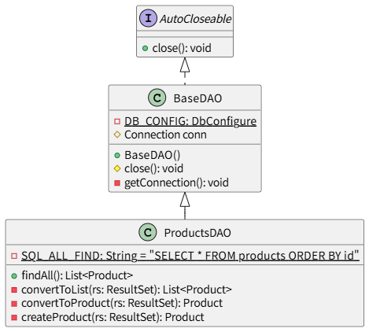
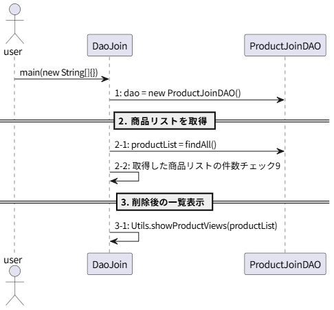
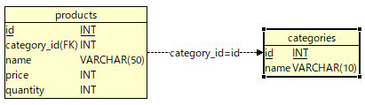

# *T2.23*　DAOによるCRUD操作・JOIN ～ 複数のテーブルを結合して検索してみた編

[Javaによるデータベース接続とCRUD操作のチュートリアル](../tutorials.md) > [DAOによるCRUD操作](./20-dao.md)

---
### 今回のチュートリアル対象

- コミット：[6571983](https://github.com/612-teacher001/jbasic-dao-demo/commit/6571983)
- クラス：[`jp.example.app.t2.DaoJoin`](https://github.com/612-teacher001/jbasic-dao-demo/blob/main/src/main/java/jp/example/app/t2/DaoJoin.java)  
　　　[`jp.example.app.dao.ProductDAO`](https://github.com/612-teacher001/jbasic-dao-demo/blob/main/src/main/java/jp/example/app/dao/ProductDAO.java)

---

## 1. 概要

このチュートリアルでは、**DAOを使って複数のテーブルを結合（JOIN）し、結合結果をオブジェクトとして取得する方法** について解説します。

---

## 2. 事前準備

データベースの詳細については、データベース接続情報を含めて [データベース概要](../00-database.md) を参照してください。

---

## 3. 解説

## 3.1. 処理の流れ
`DaoJoin#main` メソッドの処理の流れは以下のようになります：
<figure>
<figcaption>● DaoJoin#mainメソッドの処理の流れ図 ●</figcaption>
<!--  -->

</figure>

## 3.2. テーブルの関連
<figure>
<figcaption>● productsテーブルとcategoriesテーブルの関連 ●</figcaption>
<!--  -->

</figure>

## 3.3. `DaoJoin` クラス
```java
public class DaoJoin {

	...（中略）...

	public static void main(String[] args) {
		
		try (// 手順-1. ProductJoinDAOをインスタンス化
			 ProductJoinDAO dao = new ProductJoinDAO();) {
			// 手順-2. 商品リストを取得
			List<ProductView> productList = dao.findAll();
			// 手順-3. 商品リストの要素数チェック
			if (productList.isEmpty()) {
				Display.showMessageln("商品は登録されていません。");
				return;
			}
			// 手順-4. 商品リストを表示
			System.out.println();
			Utils.showProductViews(productList);
		} catch (SQLException e) {
			// 例外が発生した場合：スタックトレースを表示（必要最低限のエラー情報を表示）
			e.printStackTrace();
			return;
		}
	}

}
```
- クラスヘッダとメソッドヘッダは途中省略しました。
- 処理の流れは全件検索の流れと同じなので説明を割愛します。

## 3.4. `ProductJoinDAO` クラス
```java
public class ProductJoinDAO extends BaseDAO {

	/**
	 * クラス定数
	 */
	// SQL文字列定数群
	private static final String SQL_JOIN = """
		SELECT 
			  product.id AS id
			, product.category_id AS category_id
			, category.name AS category_name
			, product.name AS product_name
			, product.price AS price
			, product.quantity AS quantity
		FROM
			products product
			JOIN categories category
			ON product.category_id = category.id
		ORDER BY product.id;
		""";
	
	/**
	 * コンストラクタ：データベース接続オブジェクトを取得する
	 * @throws SQLException 
	 */
	public ProductJoinDAO() throws SQLException {
		super();
	}

	/**
	 * すべての商品を商品カテゴリ名を追加して表示する
	 * @return 商品カテゴリを追加した商品を要素とする商品リスト
	 * @throws SQLException 結果セット処理でエラーが発生した場合
	 */
	public List<ProductView> findAll() throws SQLException {
		
		try (// 1. SQL実行オブジェクトを取得
			 PreparedStatement pstmt = this.conn.prepareStatement(SQL_JOIN);
			 // 2. SQLの実行と結果セットの取得
			 ResultSet rs = pstmt.executeQuery();) {
			// 3. 結果セットから商品リストに変換
			List<ProductView> productList = new ArrayList<>();
			while (rs.next()) {
				// 現在行の結果セットから商品をインスタンス化
				ProductView product = new ProductView(
											  rs.getInt("id"),
											  rs.getInt("category_id"),
											  rs.getString("category_name"),
											  rs.getString("product_name"),
											  rs.getInt("price"),
											  rs.getInt("quantity")
											 );
				productList.add(product);
			}
			// 4. 戻り値を返却
			return productList;
		}
	}

}
```
- クラスヘッダは途中省略しました。
- いままでのCRUD操作（検索、登録、更新、削除）ではひとつのテーブルを対象としていました。
しかし、このチュートリアルでは複数のテーブルを利用したCRUD操作を扱っています。
- 定数 `SQL_JOIN` で定義されるSQL文は「productsテーブルのすべてのレコードに対して、`category_id` フィールドに一致したカテゴリ名を含めて表示する」というものになります。  
このとき「`category_id` フィールドに一致した categoriesテーブルの `id`のレコードの `name` フィールド」が必要になります。  
prosductsテーブルとcategoriesテーブルの関係を表現するのが「`FROM products JOIN categories`」で、一致する条件が「`ON product.category_id = category.id`」の部分です。  
- ふたつのテーブルには同一のフィールド名があるので、それぞれのフィールドが一意になるように別名を付けています。  
別名はテーブル名やテーブル名の先頭文字を指定することが一般的です。  
ここでは、`FROM products JOIN categories` でテーブルを結合し、`ON product.category_id = category.id` で結合条件を指定しています。
- このSQL　`SQL_JOIN` では、抽出したフィールド名については　`AS` 句を使ってあらためてフィールド名を指定しています。  
結果セットから参照するときにはここで指定されたフィールド名を使用します。
- `JOIN` を含むSQLは長くなりがちなので、単純値文字列定数として `"` で囲むのではなく、`"""` で囲むテキストブロックを利用すると、可読性が上がります。  
テキストブロックについては [参考：テキストブロックについて](#text-block)<a id="text-block_bak"></a>

- 別名については [参考：テーブル別名（エイリアス）について](#alias) を参照してください。<a id="alias_bak"></a>

## 3.5. `ProductView` クラス
```java
public class ProductView extends Product{

	/**
	 * フィールド
	 */
	private String categoryName;

	/**
	 * 引数なしコンストラクタ
	 */
	public ProductView() {
		super();
	}

	/**
	 * コンストラクタ
	 * @param id           商品ID
	 * @param categoryId   商品カテゴリID
	 * @param categoryName 商品カテゴリ名
	 * @param name         商品名
	 * @param price        価格
	 * @param quantity     数量
	 */
	public ProductView(int id, int categoryId, String categoryName, String name, int price, int quantity) {
		super(id, categoryId, name, price, quantity);
		this.categoryName = categoryName;
	}

	/**
	 * コンストラクタ
	 * @param categoryId   商品カテゴリID
	 * @param categoryName 商品カテゴリ名
	 * @param name         商品名
	 * @param price        価格
	 * @param quantity     数量
	 */
	public ProductView(int categoryId, String categoryName, String name, int price, int quantity) {
		super(categoryId, name, price, quantity);
		this.categoryName = categoryName;
	}

	public String getCategoryName() {
		return categoryName;
	}

	public void setCategoryName(String categoryName) {
		this.categoryName = categoryName;
	}
	
	/**
	 * シリアル化メソッド：オブジェクトの文字列化
	 */
	@Override
	public String toString() {
		StringBuilder builder = new StringBuilder();
		builder.append("Product [");
		builder.append("id=" + this.getId() + ", ");
		builder.append("categoryId=" + this.getCategoryId() + ", ");
		builder.append("categoryName=" + categoryName + ", ");
		builder.append("name=" + this.getName() + ", ");
		builder.append("price=" + this.getPrice() + ", ");
		builder.append("quantity=" + this.getQuantity());
		builder.append("]");
		return builder.toString();
	}

	/**
	 * 比較用文字列を取得する
	 * @return idフィールドを除いたシリアル化文字列
	 */
	public String toStringCompared() {
		StringBuilder builder = new StringBuilder();
		builder.append("Product [");
		builder.append("categoryId=" + this.getCategoryId() + ", ");
		builder.append("categoryName=" + categoryName + ", ");
		builder.append("name=" + this.getName() + ", ");
		builder.append("price=" + this.getPrice() + ", ");
		builder.append("quantity=" + this.getQuantity());
		builder.append("]");
		return builder.toString();
	}
	
}
```
- 表示する項目が`Product` クラスだけでは足りないので、表示用クラスとして `Product` クラスを継承した `ProductView` クラスを定義します。  
- `ProductView` クラスは、`Product` クラスに `categoryName` フィールドを追加したクラスです。  
フィールド追加に伴って、コンストラクタやアクセサメソッド、シリアル化メソッドが変更されています。
- このように、データベースから取得した値をそのまま保持するクラス（DB寄り）と、表示内容に合わせて項目を追加・整形したクラス（表示寄り）のように、JavaBeansが目的別に分化していく点が本チュートリアルのポイントです。


## 3.6. `Utils` クラス
```java
public class Utils {

...（中略）...

	/**
	 * 商品カテゴリ名付き商品インスタンスを表示する
	 * @param productList 表示する商品リスト
	 */
	public static void showProductViews(List<ProductView> productList) {
		// 件数の表示
		Display.showMessageln("検索結果：" + productList.size() + "件の商品が見つかりました。");
		// 見出し行の表示
		System.out.println(); // 区切り用の空行
		System.out.printf("%-4s\t%-4s\t%-8s\t%-16s\t%-4s\t%-4s\n", 
						  "商品ID", "カテゴリID", "カテゴリ名", "商品名", "価格", "数量");
		// 商品リストの表示
		for (ProductView product : productList) {
			System.out.printf("%-4d\t%-4d\t%-8s\t%-16s\t%-4d\t%-4d\n",
					product.getId(),
					product.getCategoryId(),
					product.getCategoryName(),
					product.getName(),
					product.getPrice(),
					product.getQuantity()
				 );
		}
	}

}
```


## 5. まとめ

ここのコードで学ぶべきポイント：

- JOINを使うと、**複数のテーブルに分かれた情報を1回のSQLでまとめて取得できる**  
- 結合時は、テーブルに**別名（エイリアス）**を付けてフィールド名の衝突を避ける  
- 取得結果を格納するために、**表示専用のBean（Viewクラス）**を定義すると整理しやすい  
- DAOはSQLを、Beanはデータ構造を、表示クラス（Utils）は出力形式をそれぞれ分担することで、  
  コードの責務が明確になり、再利用性が向上する

今回は全件検索の操作でJOINを利用してみましたが、JOINはSELECTだけでなく、UPDATEやDELETE文でも使用できます。
たとえば「カテゴリが削除されたら関連する商品も削除する」といった処理もJOIN句を使って効率的に記述できます。

## 参考：テキストブロックについて<a id="text-block"></a>
Java 15 以降で使える `"""` で囲む文字列のことを **テキストブロック** と呼びます。  
複数行の文字列をそのまま書くことができ、SQLやHTMLなどの構造を崩さずにコード内で扱えます。

テキストブロックを使うメリットとしては以下のようになります：

- 複数行の文字列をそのまま書ける
- インデントや改行を含めて扱える
- SQLやHTML、JSONなど「構造を見せたい文字列」に最適

多くの言語ではヒアドキュメントという言い方をすることがあります。

[ジャンプ元に戻る](#text-block_bak)

## 参考：テーブル別名（エイリアス）について<a id="alias"></a>
SQLでは、テーブルに短い別名（エイリアス）を付けて参照するのが一般的です。
ただし、実際の書き方にはいくつかのスタイルがあります。

| スタイル   | 採用率（目安）  | 主な利用場面    |
|-----------|----------------|----------------|
| **テーブル名そのまま**              | ★★☆☆☆ | チュートリアル・ビュー定義など         |
| **テーブル名の単数形をエイリアスに** | ★★★☆☆ | 教材・設計書など（可読性重視）         |
| **略称（p, c, o など）**           | ★★★★★ | チーム開発・実務SQL（省入力・効率重視） |

このチュートリアルではテーブル名の単数形を採用していますが、実務では略称を利用することが多くなります。

### このチュートリアルでのエイリアスについての方針
1行分のデータ（レコード）を指すことが直感的に伝わるよう、テーブル名の単数形をエイリアスとして使用します。  
これはテーブル名をそのテーブルが格納するデータの複数形とするということを前提としています。

[ジャンプ元に戻る](#alias_bak)

---

## 演習問題

[Javaによるデータベース接続とCRUD操作のチュートリアル](../tutorials.md) > [DAOによるCRUD操作](./20-dao.md)
